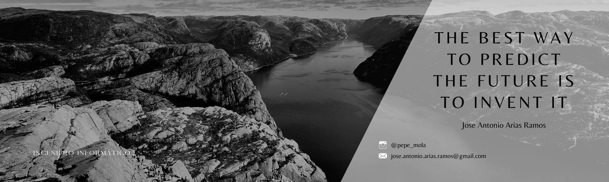

<h3 align="center">Backend Software Engineer | Java & Spring Specialist</h3>
<h3 align="center">Architecture • DevOps • AI</h3>

---

# 🙋‍♂️ About me
I design and build **scalable backend systems** where architecture, performance, DevOps, and AI work together — not in isolation.

- 🚀 **Backend Software Engineer at Capgemini**

- 🔭 I studied at **[Universidad de Castilla-La Mancha](https://www.uclm.es/)** 

- 🌱 Graduate in **Computer Engineering**, specialized in *__Software Engineering__*

- 📫 My personal email is **jose.antonio.arias.ramos@gmail.com**

---

## 🧠 What I Do

- 🏗️ Design **microservices architectures** (MVC, DDD, CQRS, SAGA)
- ⚡ Build **reactive systems** with Spring WebFlux & Project Reactor
- 🔁 Develop **event-driven systems** with Kafka & RabbitMQ
- 🤖 Integrate **AI into real systems** (LLM agents, automation workflows)
- 🚀 Apply **DevOps practices**: Docker, cloud, production-ready systems

---

## ⚙️ Tech Stack

### 👨‍💻 Backend
- Java, Spring Framework (Spring Boot, Spring WebFlux, Spring Security, Spring Batch).
- REST APIs, Reactive Programming, High-performance systems.

### 🏗️ Architecture
- Microservices, MVC, DDD, CQRS, SAGA
- Clean Architecture, scalable system design

### 🔁 Messaging & Data
- Apache Kafka, RabbitMQ
- PostgreSQL, Oracle, MongoDB, Redis

### ⚙️ DevOps & Cloud
- Docker, Docker Compose
- Private VPS management
- AWS / GCP (S3, IAM, Compute, etc.)

### 🤖 AI Engineering
- LLM-based agents
- AI-driven development workflows

---

## ⚡ Connect with me ⚡

